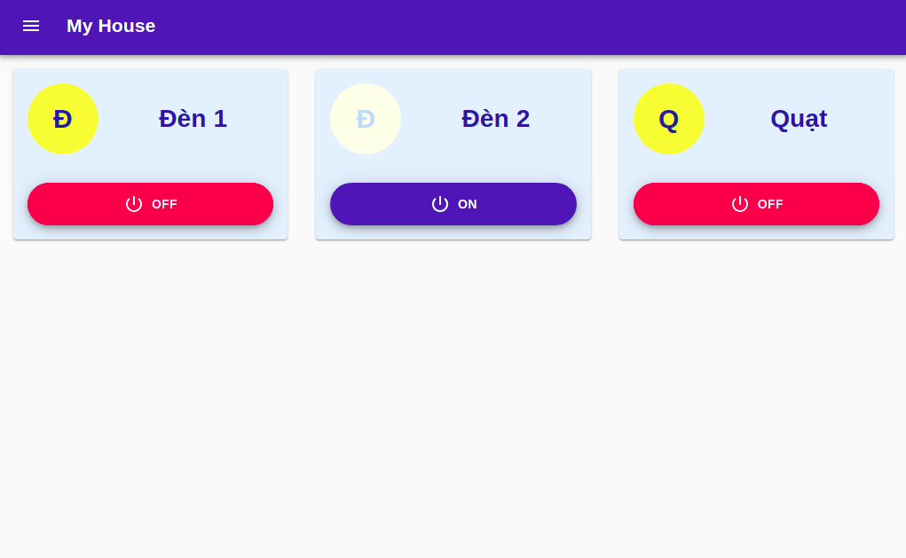
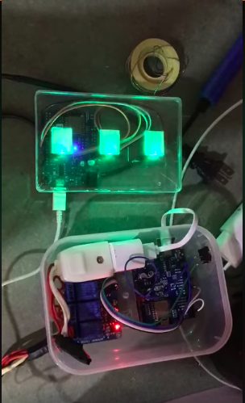

# My House

## How to use?
clone project to your vps or your computer
`git clone https://github.com/mhqb365/my-house.git`

### MQTT Server
1. `cd my-house`
2. `npm install`
3. `node mqtt-server`

### Web Server
1. `node web-server`

### Webapp Development Environment
1. `cd webapp`
2. `npm install`
3. `npm start`

### Webapp Production
1. `cd webapp`
2. `npm run build`

### ESP8266 Devices
1. Download and add librarys
    - [https://github.com/knolleary/pubsubclient](https://github.com/knolleary/pubsubclient)
    - [https://github.com/bblanchon/ArduinoJson](https://github.com/bblanchon/ArduinoJson)
2. Modify IP address of mqtt server into esp8266/devices.ino then flash to esp8266

### ESP8266 Buttons
1. Download and add librarys
    - [https://github.com/knolleary/pubsubclient](https://github.com/knolleary/pubsubclient)
    - [https://github.com/bblanchon/ArduinoJson](https://github.com/bblanchon/ArduinoJson)
2. Modify IP address of mqtt server into esp8266/buttons.ino then flash to esp8266