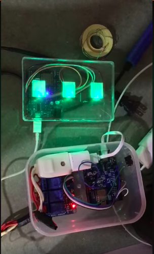

# My House

## How to use:

### Server
1. `git clone https://github.com/mhqb365/my-house.git`
2. `cd my-house`
3. `npm install`
4. `node mqtt-server`

use your ip address of mqtt server for esp8266

### Esp8266
1. Download and add librarys
    - [https://github.com/knolleary/pubsubclient](https://github.com/knolleary/pubsubclient)
    - [https://github.com/bblanchon/ArduinoJson](https://github.com/bblanchon/ArduinoJson)
2. Modify ip address of mqtt server then flash devices.ino to esp8266 for devices and buttons.ino to esp8266 for button

